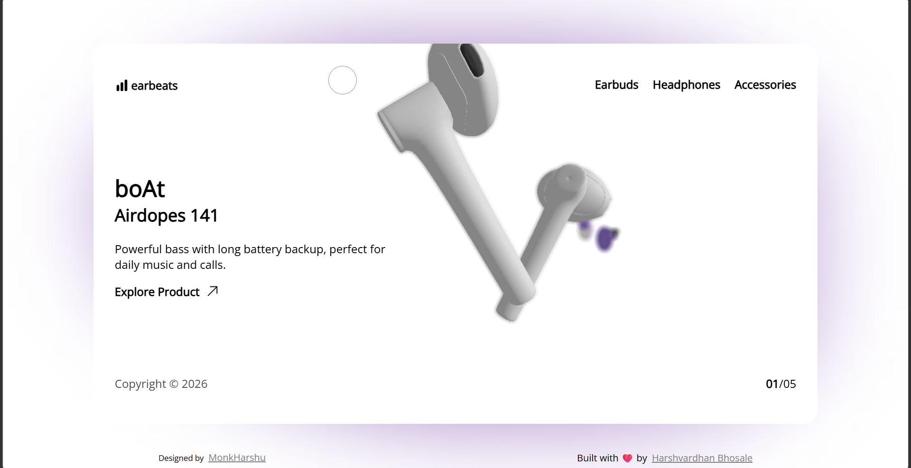
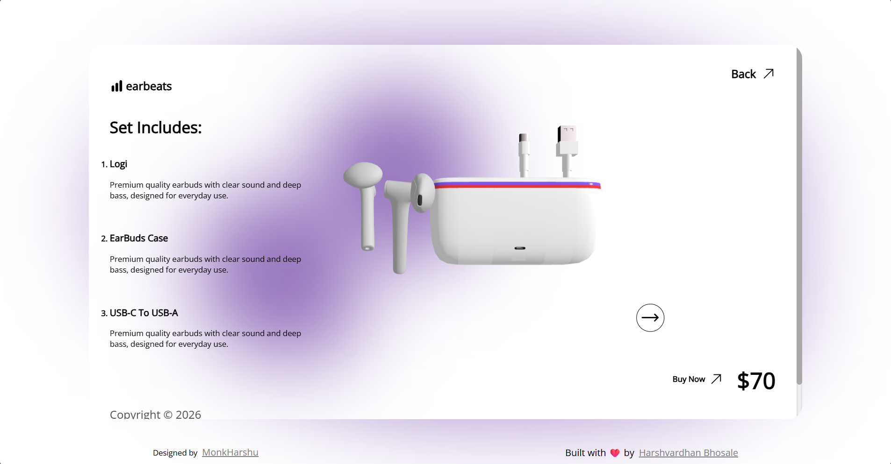

# 🛒 Ecommerce Three.js

An interactive **3D e-commerce web application** built using **Three.js** to deliver an immersive shopping experience.

---

## 🚀 Features

- 🧊 3D Product Visualization  
- 🛍️ Interactive product display  
- 🎯 Smooth camera controls  
- ⚡ Real-time rendering  
- 💻 Responsive UI  

---

## 🛠️ Tech Stack

- HTML, CSS, JavaScript  
- Three.js  
- WebGL  

---

## 📂 Project Structure

Ecommerce_Threejs/

│── index.html

│── style.css

│── script.js

│── assets/

│   └── screenshots/

│       ├── home.png

│       ├── product.png

│       └── view.png

│── README.md

---

## 📸 Screenshots

  
  
  

---

## ⚙️ Installation

git clone https://github.com/Harshsbhosal96/Ecommerce_Threejs.git      
cd Ecommerce_Threejs

🎮 Usage

- Rotate products
- Zoom in/out
- Explore 3D models interactively

🌟 Future Improvements

- Backend integration
- Payment gateway

🤝 Contributing

Fork the repo

Create a branch

Commit changes

Push and create PR

👨‍💻 Author

Harshvardhan Bhosale

https://github.com/Harshsbhosal96

Hope you guys enjoyed. Happy Coding!
